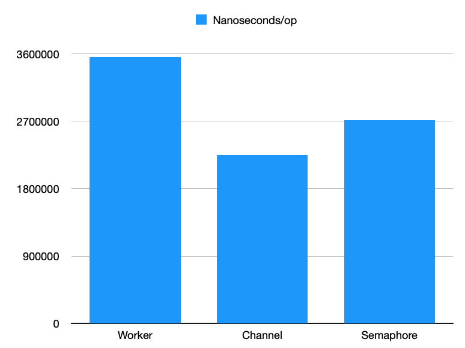

# Go Worker Pools

This repo demonstrates three different strategies for implementing Go worker
pools with bounded concurrency.

I do not guarantee that any of this code is production-ready. This is simply an
experiment to compare different strategies for managing concurrency in Go.

These worker pools satisfy a basic common interface so that we can test and
bench them against each other:

- Users can `Submit()` a function task to the pool. This function will not
  block.
- Users can `Wait()` for all work in the pool to complete.

The following worker pool strategies are featured here:

- [Channel pool](channelpool.go): Use a buffered channel to limit concurrency.
  To queue a task, first put a `struct{}` into the channel – this will block if
  too many tasks are running. Once your task is done, receive a struct from the
  channel and throw it away. This frees up space for another `struct{}`.
- [Semaphore pool](semaphorepool.go): Use a semaphore to limit concurrency as
  described in the
  [package docs](https://pkg.go.dev/golang.org/x/sync@v0.0.0-20220722155255-886fb9371eb4/semaphore#example-package-WorkerPool).
- [Worker pool](workerpool.go): Use the
  [gammazero/workerpool](https://github.com/gammazero/workerpool) package to
  limit concurrency. This is my favorite interface and it's what I use in my
  projects.

Run tests with `go test ./... -race`. This tests all pools and ensures that they
complete all jobs, use the full concurrency available, and do not exceed the
specified concurrency.

Run benchmarks with `go test bench=.`. Here are the results from running an
extended benchmark on my 2020 M1 MacBook Air:

```
$ go test -bench=. -benchtime=60s
goos: darwin
goarch: arm64
pkg: github.com/mplewis/go-worker-pools
BenchmarkWorkerPool-8      	   21027	   3554945 ns/op
BenchmarkChannelPool-8     	   31254	   2253164 ns/op
BenchmarkSemaphorePool-8   	   28473	   2572525 ns/op
```


